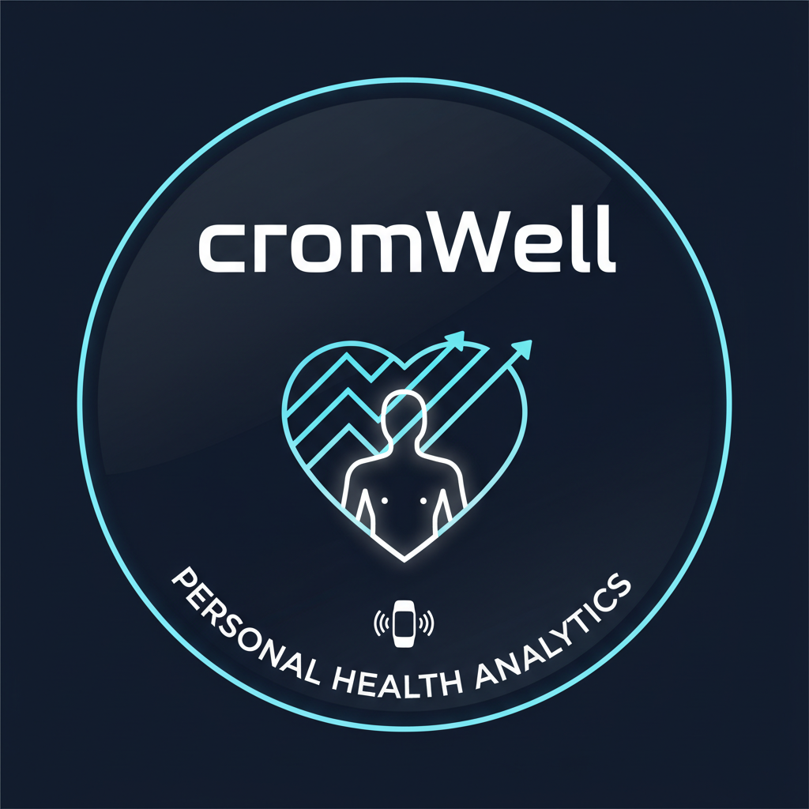

# 👋 followCrom on GitHub 👋

## 🎧 // DJ turned Developer // 💻

### ⚙️ From Spinning Tunes to Spinning Up Servers ...

<table style="width:100%; background-color:#222; border-collapse:separate; border-spacing:10px;">
  <tr>
    <td style="background-color:#444; border-radius:10px; padding:10px; border:1px solid #FFF;">
          

            

    </td>
    <td style="background-color:#444; border-radius:10px; padding:10px; border:1px solid #FFF;">
      <h2 style="color:#FFF;"><a href="https://followcrom.com" target="_blank">followCrom online</a></h2>
      🔗 Visit the <a href="https://followcrom.com" target="_blank" style="text-decoration:underline; color:#0FF;">website</a> to see the projects I've been working on.
       
      &#x1F4E6; Get the code <a href="https://github.com/followcrom/followcromSite" style="text-decoration:underline; color:#0FF;">from the repo</a>.
    </td>
  </tr>
  <tr>
    <td style="background-color:#444; border-radius:10px; padding:10px; border:1px solid #FFF;">
      

        
      

    </td>
    <td style="background-color:#444; border-radius:10px; padding:10px; border:1px solid #FFF;">
      <h2 style="color:#FFF;"><a href="https://play.google.com/store/apps/details?id=com.followcrom.domdom" target="_blank">RanDOM WisDOM</a></h2>
      🔗 Get some perspective with the Android app. <a href="https://play.google.com/store/apps/details?id=com.followcrom.domdom" target="_blank" style="text-decoration:underline; color:#0FF;">Free from the Play Store</a>. 
       
      &#x1F4E6; This repo is private.
    </td>
  </tr>
  <tr>
    <td style="background-color:#444; border-radius:10px; padding:10px; border:1px solid #FFF;">
          

            

    </td>
    <td style="background-color:#444; border-radius:10px; padding:10px; border:1px solid #FFF;">
      <h2 style="color:#FFF;"><a href="https://mixtape.followcrom.com/" target="_blank">MixTape HeavyWeight</a></h2>
      🔗 <a href="https://mixtape.followcrom.com/" target="_blank" style="text-decoration:underline; color:#0FF;">DJ mix player</a> with updating tracklist, EQ, audio visualizer, and comments section.
       
      &#x1F4E6; Get the code <a href="https://github.com/followcrom/MixTapeHeavyWeight" style="text-decoration:underline; color:#0FF;">from the repo</a>.
    </td>
  </tr>
    <tr>
    <td style="background-color:#444; border-radius:10px; padding:10px; border:1px solid #FFF;">
          

            

    </td>
    <td style="background-color:#444; border-radius:10px; padding:10px; border:1px solid #FFF;">
      <h2 style="color:#FFF;"><a href="https://followcrom.github.io/jellygut/" target="_blank">Jelly Gut</a></h2>
      🔗 A GitHub-authenticated <a href="https://followcrom.github.io/jellygut/" target="_blank" style="text-decoration:underline; color:#0FF;">interactive web calendar</a> for efficient task management.
       
      &#x1F4E6; Get the code <a href="https://github.com/followcrom/jellygut" style="text-decoration:underline; color:#0FF;">from the repo</a>.
    </td>
  </tr>
  <tr>
    <td style="background-color:#444; border-radius:10px; padding:10px; border:1px solid #FFF;">
            

          

          </td>
    <td style="background-color:#444; border-radius:10px; padding:10px; border:1px solid #FFF;">
      <h2 style="color:#FFF;"><a href="https://followcrom.com/wotd/" target="_blank">Word of the Week</a></h2>
      🔗 Automated script emails a <i>Word of the Week</i> to a mailing list. <a href="https://followcrom.com/wotd/" target="_blank" style="text-decoration:underline; color:#0FF;">Subscribe now</a>.
       
      &#x1F4E6; Get the code <a href="https://github.com/followcrom/word-of-the-week" style="text-decoration:underline; color:#0FF;">from the repo</a>.
    </td>
  </tr>
    <tr>
    <td style="background-color:#444; border-radius:10px; padding:10px; border:1px solid #FFF;">
            

          
</td>
    <td style="background-color:#444; border-radius:10px; padding:10px; border:1px solid #FFF;">
      <h2 style="color:#FFF;"><a href="https://followcrom.com/momcon/" target="_blank">Momento Contento</a></h2>
      Flask app connected to a MySQL database on the back-end. <a href="https://followcrom.com/momcon/" target="_blank" style="text-decoration:underline; color:#0FF;">See it in action</a>.
       
      &#x1F4E6; Get the code <a href="https://github.com/followcrom/momento_contento" style="text-decoration:underline; color:#0FF;">from the repo</a>.
    </td>
  </tr>
      <tr>
    <td style="background-color:#444; border-radius:10px; padding:10px; border:1px solid #FFF;">
            

          
</td>
    <td style="background-color:#444; border-radius:10px; padding:10px; border:1px solid #FFF;">
      <h2 style="color:#FFF;"><a href="https://github.com/followcrom/cromWell" target="_blank">CromWell</a></h2>
      Fetch and analyze your Fitbit health data. Uses Fitbit API to pull data and visualize them with Plotly.
       
      &#x1F4E6; Get the code <a href="https://github.com/followcrom/cromWell" style="text-decoration:underline; color:#0FF;">from the repo</a>.
    </td>
  </tr>
    <tr>
    <td style="background-color:#444; border-radius:10px; padding:10px; border:1px solid #FFF;">
            

    </td>
    <td style="background-color:#444; border-radius:10px; padding:10px; border:1px solid #FFF;">
      <h2><a href="https://followcrom.com/contact/contact.php" target="_blank">Get in Touch</a></h2>
      For collaborations, development projects, or anything that floats you boat! ⛵
       
      &#x1F4E6; Get the code <a href="https://github.com/followcrom/followcromSite" target="_blank"  style="text-decoration:underline; color:#0FF;">from the repo</a>.
    </td>
  </tr>
</table>

 

## 🥣 Mixing Skills

- 🐍 **Python**: backend development, Django, Flask

- 📱 **Apps**: web and mobile applications

- 🖥️ **Cloud**: AWS cloud practitioner

- 📈 **Data**: data analysis and visualization

- 🎨 **Design**: UI/UX design

- 📚 **Docs**: documentation

 

---

## 📢 Socials

 

---

## 🌍 Communicating in Meat Space 🥦

**English** 🇬🇧, **Spanish** 🇪🇸, and  **French** 🇫🇷.

 

---

 

